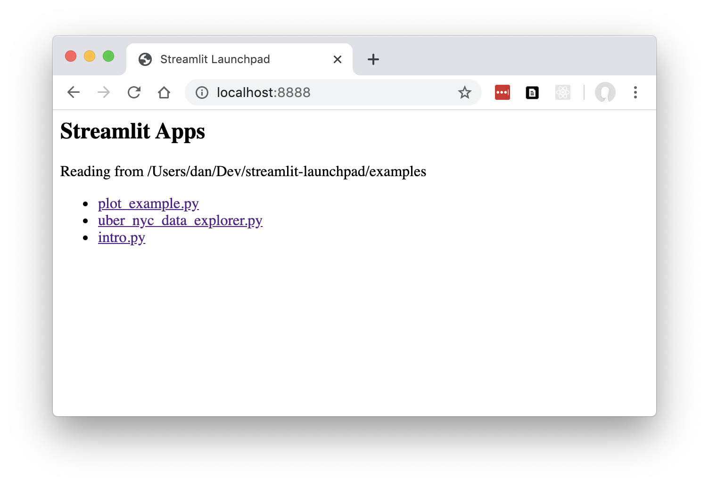

# Streamlit Launchpad

Web launchpad to browse a folder containing multiple Streamlit applications (py files), with a central launchpad listing available apps so you can run them (if not already running) and view each in its own tab.

This is a very basic alpha version.

## Install and Run

Install using pip.

```
pip install streamlit-launchpad
```

Serves *.py as separate Streamlit applications from the folder supplied on the command line:

```
streamlit-launchpad ./examples
```

Then go to http://localhost:8000/ in your browser:



To run on a different port use:

```
streamlit-launchpad --port 8000 ./examples
```

## Development install

```
git clone https://github.com/ideonate/streamlit-launchpad.git
cd streamlit-launchpad

pip install -e .

streamlit-launchpad ./examples
```

To run directly in python: `python -m launchpad.main ./examples/`
